```mermaid
sequenceDiagram
    autonumber
    actor Gen as Generador (Goroutine)
    participant Cola as Cola (Channel)
    participant Mec as Mecánico (Worker)
    participant Sys as Sistema (Escalado)
    actor Log as Log / Salida
    actor NewMec as Nuevo Mecánico (Emergencia)

    Note over Gen, Cola: Productor
    Gen->>Cola: 1. Enviar Vehículo (Incidencia X)
    
    Note over Cola, Mec: Consumidor
    Cola->>Mec: 2. Recibir Vehículo
    
    activate Mec
    Mec->>Mec: 3. Verificar Especialidad (m.Especialidad == v.Incidencia)
    
    alt Especialidad NO Coincide (Y no es prioritario)
        Mec->>Cola: 4. Devolver a la cola (Rechazo)
    else Especialidad Coincide o Es Prioritario
        Mec->>Mec: 5. Procesar (time.Sleep(TiempoIncidencia))
        
        alt Tiempo Acumulado <= 15s (Normal)
            Mec->>Log: 6. Finalizado (v.TiempoTotal: X s)
        else Tiempo Acumulado > 15s (Crítico)
            Mec->>Sys: 7. Alerta: Umbral Excedido (>15s)
            activate Sys
            Sys->>NewMec: 8. CONTRATAR (go rutinaMecanico)
            Note right of NewMec: Especialidad = Incidencia
            deactivate Sys
            activate NewMec
            Mec->>Cola: 9. Reingresar con Prioridad (v.EsPrioritario = true)
            deactivate Mec
            
            Cola->>NewMec: 10. Recibir Vehículo Prioritario
            NewMec->>NewMec: 11. Procesar y Finalizar
            NewMec->>Log: 12. Finalizado (v.TiempoTotal: >15s)
            deactivate NewMec
        end
    end
```

# 🛠️ Práctica 2: Sistemas Distribuidos - Taller de Coches Concurrente

## 📋 Tabla de Contenidos
1.  [🌟 Introducción](#-introducción)
2.  [🎯 Objetivo del Programa](#-objetivo-del-programa)
3.  [🛠️ Descripción Técnica](#-descripción-técnica)
    * [Componentes del Sistema](#componentes-del-sistema)
    * [Concurrencia y Escalado Dinámico](#concurrencia-y-escalado-dinámico)
    * [Tiempos de Servicio y Umbral de Escalado](#tiempos-de-servicio-y-umbral-de-escalado)
4.  [📊 Diagramas de Flujo](#-diagramas-de-flujo)
5.  [🧪 Resultados de las Pruebas](#-resultados-de-las-pruebas)
6.  [📜 Conclusiones](#-conclusiones)
7.  [🚀 Ejemplos de Uso](#-ejemplos-de-uso)
8.  [📂 Código Fuente](#-código-fuente)

---

## 🌟 Introducción

Esta práctica implementa la simulación de un **Taller de Coches** utilizando los principios de **Sistemas Distribuidos** y **Concurrencia en Go**. A diferencia de la Práctica 1, el sistema opera con múltiples **`goroutines`** (mecánicos, generador de coches) y **`channels`** (cola de espera) para gestionar el flujo de trabajo.

El aspecto central de esta implementación es el **escalado dinámico de recursos**: si un vehículo acumula un tiempo excesivo de atención, el sistema reacciona automáticamente contratando un nuevo mecánico de la especialidad requerida para mitigar la congestión.

---

## 🎯 Objetivo del Programa

El objetivo es modelar un taller automotriz de manera concurrente, asegurando:
* **Atención Concurrente:** Cada vehículo es una tarea independiente atendida por un `Mecánico` (goroutine).
* **Cola Ilimitada:** La cola de vehículos no tiene un límite predefinido.
* **Escalado de Emergencia:** Implementar la lógica para detectar vehículos con **más de 15 segundos** de atención acumulada y, en respuesta, realizar una **contratación de emergencia** de un nuevo mecánico especializado.
* **Filtro de Especialidad:** Los mecánicos deben priorizar vehículos de su especialidad (`mecanica`, `electrica`, `carroceria`) a menos que el vehículo sea prioritario.

---

## 🛠️ Descripción Técnica

### Componentes del Sistema

| Componente | Mecanismo Go | Función Principal |
| :--- | :--- | :--- |
| **Vehículo** | `struct` | Unidad de trabajo, con campo para registrar `TiempoAtencion` y `EsPrioritario`. |
| **Mecánico** | `goroutine` | Worker que atiende vehículos durante un tiempo simulado. Tiene una `Especialidad`. |
| **Cola de Espera** | `channel` | Canal por el que fluyen los vehículos. Modeliza la cola de espera ilimitada. |
| **Lógica de Escalado** | Función `gestionarEscalado` | Detecta el umbral de 15s y dispara la contratación de un nuevo `Mecánico`. |

### Concurrencia y Escalado Dinámico

* **Goroutines:** Cada `Mecánico` activo y la función `generadorDeVehiculos` corren como goroutines separadas.
* **Channels:** El canal principal (`colaVehiculos`) gestiona la transferencia de trabajo.
* **Contratación:** Cuando un vehículo escala, se llama a `contratarMecanicoDeEmergencia(especialidad)` para lanzar una nueva goroutine (`Mecánico`) con la especialidad requerida.
* **Prioridad:** El vehículo escalado se reinserta en la cola con el flag `EsPrioritario = true`. Los mecánicos atienden a los prioritarios sin importar su especialidad.

### Tiempos de Servicio y Umbral de Escalado

| Incidencia | Tiempo de Atención Medio |
| :--- | :--- |
| **Mecánica** | 5 segundos |
| **Eléctrica** | 7 segundos |
| **Carrocería** | 11 segundos |

**Umbral de Escalado:** Si un vehículo acumula **más de 15 segundos** de atención, se marca como prioritario y se dispara el mecanismo de contratación.

---

## 📊 Diagramas de Flujo

### Flujo de Escalado Dinámico (UML Sequence)

El siguiente diagrama de secuencia ilustra el proceso de asignación de trabajo y la respuesta del sistema ante la saturación.


### 4.2 Flujo de Escalado Dinámico (UML Sequence)

El siguiente diagrama de secuencia ilustra el proceso de asignación de trabajo y la respuesta del sistema ante la saturación.


---

## 🧪 Resultados de las Pruebas

Se realizaron comparativas bajo las condiciones exigidas, usando el paquete `time` de Go para las métricas:

### 1. Duplicación de Carga (Stress Test)
* **Caso:** 1 Mecánico vs. **Generación Rápida** de vehículos.
* **Resultado:** El log mostró múltiples mensajes de `[ESCALADO]` seguidos de `[CONTRATACIÓN]`. El sistema demostró ser **auto-escalable**, contratando mecánicos hasta que la tasa de atención igualó o superó la tasa de llegada.

### 2. Comparativa de Plantilla
* **Caso:** 3 Mecánicos (1 por especialidad) vs. 6 Mecánicos (2 por especialidad).
* **Resultado:** Con **3 mecánicos**, se observó una acumulación constante en la cola de espera y escalados ocasionales. Con **6 mecánicos**, la cola se mantuvo próxima a cero, confirmando la **mejora de rendimiento** al duplicar la plantilla.

### 3. Comparativa de Especialistas (Cuello de Botella Controlado)
* **Caso:** 1 Mecánico Mecánica, 3 Eléctrica, 3 Carrocería.
* **Resultado:** Los vehículos de tipo **Mecánica** sufrieron mayores tiempos de espera, ya que los mecánicos de otras especialidades los rechazaban. Esto obligó al sistema a contratar nuevos mecánicos de emergencia específicamente de la especialidad **Mecánica** cuando el cuello de botella se hacía crítico.

---

## 📜 Conclusiones

### Estabilidad y Robustez
El sistema implementado con `goroutines` y `channels` demostró ser robusto y estable, gestionando correctamente la concurrencia sin *deadlocks* ni *race conditions* aparentes.

### Eficiencia del Escalado Dinámico
La regla de **escalado > 15s** y la contratación inmediata de especialistas fue efectiva para mitigar la saturación. Este mecanismo asegura que los problemas de congestión se resuelvan de forma autónoma.

### Impacto de la Especialización
El sistema es sensible al desequilibrio de plantilla. Si la carga de trabajo de un tipo (ej. Mecánica) excede la capacidad de sus especialistas, el tiempo de espera para ese tipo se dispara, confirmando la necesidad de optimizar la plantilla en función de la demanda.

---

## 🚀 Ejemplos de Uso

```bash
--- Iniciando simulacion del taller --- 
Arrancando 1 mecanicos...
Mecanico David (ID: 1) listo para trabajar. 
...
+++ [LLEGADA] Nuevo vehículo SIM-4 con incidencia carroceria ha llegado a la cola.
... [ATENCIÓN] Mecánico David atendiendo SIM-4 (carroceria). Acumulado: 0s
!!! [ESCALADO] Vehículo SIM-4 ha superado el umbral de atención (16s). Marcado como prioritario.
+++ [CONTRATACIÓN] Contratado Emergencia-2 (Especialidad: carroceria) para desatascar la cola.
>>> [REINGRESO] Vehículo SIM-4 reingresado a la cola con prioridad.
... [ATENCIÓN] Mecánico Emergencia-2 atendiendo SIM-4 (carroceria). Acumulado: 0s
>>> [SALIDA] Vehículo SIM-4 finalizado. Tiempo total atención: 18s
